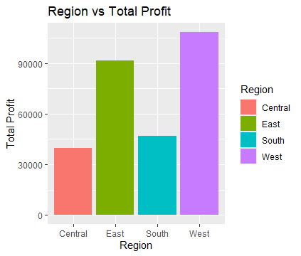
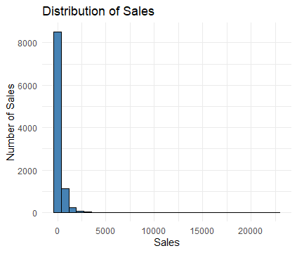
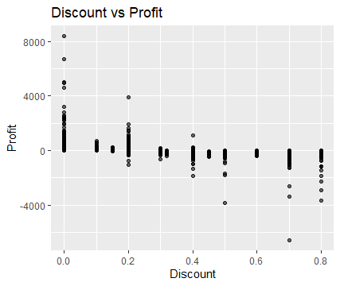

# Project Title 
Superstore Sales Analysis Using R Functions

# Project Overview
This project presents an exploratory data analysis of a retail business dataset known as the Superstore Sales Dataset obtained from Kaggle. The goal of the analysis is to understand key sales patterns, profitability performance, and the relationship between discounts and profit.
The dataset contains transactional records including product categories, sales revenue, profit, discount levels, regions, and order quantities. Using the R programming language, the project analyzes how different product categories and regions contribute to overall business performance.
A key objective of this project is to demonstrate the use of custom R functions to automate common analytical tasks such as calculating total sales, total profit, and summarizing business performance by categories and regions.
Using R libraries such as tidyverse, dplyr, and ggplot2, the project explores several business questions including identifying top-performing product categories, determining the most profitable regions, understanding sales distribution patterns, and examining the relationship between discount strategies and profitability.
The insights generated from this analysis provide practical business recommendations that can help organizations improve pricing strategies, optimize sales performance, and strengthen decision-making processes.

# Tools Used
•	R
•	tidyverse: For data analysis workflow
•	dplyr: For data manipulation and summarization
•	ggplot2: For data visualization

# Data Description
Source: Superstore Sales Dataset (CSV file obtained from Kaggle)
The dataset contains transactional records representing sales operations of a retail business. Each row represents a product purchase associated with an order.
Dataset Variables:
•	Ship Mode: Shipping method used for delivery
•	Segment: Customer segment classification
•	Country: Country where the order was placed
•	City: City where the customer is located
•	State: State of the customer
•	Postal Code: Postal code of the customer location
•	Region: Geographic sales region
•	Category: Product category (e.g., Furniture, Office Supplies, Technology)
•	Sub-Category: Product sub-category
•	Sales: Revenue generated from the order
•	Quantity: Number of units purchased
•	Discount: Discount applied to the order
•	Profit: Profit earned from the transaction

# Engineered Variables (Created During Analysis)
To support analytical tasks and reusable computations, several analytical functions were created using R:
•	calculate_total_sales(): Calculates total sales revenue from the dataset
•	calculate_total_profit(): Calculates total profit generated
•	average_sales(): Computes the average sales value per order
•	sales_by_category(): Aggregates total sales grouped by product category
•	profit_by_region(): Aggregates total profit grouped by region
These reusable functions improve efficiency and allow the same logic to be applied easily across datasets.

# Data Cleaning
Before performing the analysis, the dataset was inspected to ensure accuracy and reliability. The following preprocessing steps were carried out:
•	Checked dataset structure using str() to understand variable types.
•	Checked for missing values using anyNA() and colSums(is.na()).
•	Verified that key numerical variables such as Sales, Profit, and Discount were stored in the correct numeric format.
•	Confirmed dataset readiness for analysis before applying aggregation functions and visualizations.

# Business Questions
The analysis was guided by the following key business questions:
•	Which product category generates the highest total sales revenue?
•	Which region produces the highest overall profit?
•	What is the average sales value per order?
•	Do higher discount levels reduce profit margins?
•	What does the distribution of sales values reveal about order behavior?
•	What business strategies could improve sales and profitability?

# Key Insights 
•	The Technology category generated the highest total sales revenue, contributing 836,154.0 in total sales.
•	The West region produced the highest profit with approximately 108,418.45, indicating strong business performance in that geographic market.
•	The average sales value per order is approximately 229.86, suggesting that most individual purchases are relatively moderate in value.
•	The analysis revealed a negative relationship between discount levels and profitability, where higher discounts often correspond to lower or even negative profits.
•	The sales distribution histogram shows that most transactions involve relatively small sales amounts, while a smaller number of transactions generate very large sales values.

# Visualization
Charts were created using ggplot2 to visually communicate the findings: Bar Chart: Product Category vs Total Sales. Bar Chart: Region vs Total Profit. Histogram: Distribution of Sales Values. Scatter Plot: Relationship Between Discount and Profit. These visualizations help highlight sales performance patterns, profitability distribution, and pricing strategy effects.

Technology has the highest sales. Furniture comes next. Office Supplies has the lowest. Technology products are the best-selling category.

The West region is the most profitable area for the business. The East is also performing well. The Central region may need improvement (low profit could mean low sales or high costs)

Most sales are small amounts. Very few sales are very large. The data is skewed to the right (a few big sales, many small ones). The business makes many small sales and only a few high-value sales.

As discount increases, profit generally decreases. High discounts (like 0.6 – 0.8) often lead to losses (negative profit). Low or no discount tends to give higher profit. Giving too much discount is hurting the business.

# Conclusion and Recommendation
The analysis shows that the Technology product category plays a major role in driving overall sales revenue, while the West region contributes the highest profit for the business.
Additionally, the relationship between discount levels and profit indicates that aggressive discount strategies may negatively impact profitability. While discounts can help increase sales volume, excessive discounting may erode profit margins.
Based on these findings, the business should consider the following strategies:
•	Focus marketing efforts on high-performing product categories such as Technology.
•	Strengthen operations and customer engagement in profitable regions like the West region.
•	Carefully manage discount policies to avoid excessive reductions that negatively impact profit margins.
•	Encourage larger order values through strategies such as product bundles, upselling, and promotional packages.
These actions could help improve both revenue growth and long-term profitability.

# Author
Franklin Chisom  
Junior Data Analyst | Aspiring Data Scientist | R Programming Enthusiast
